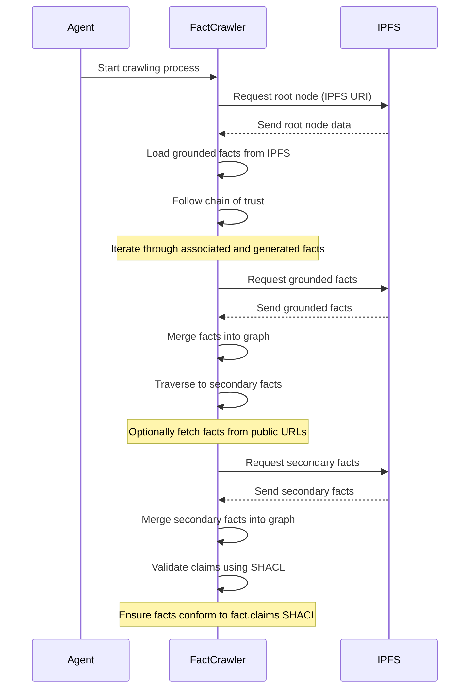
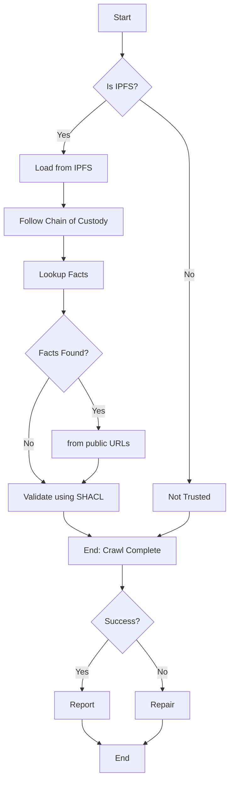

# Designing a Fact Finder

The `fact web` is represented as linked data serialized as JSON-LD. We find facts by crawling - just like a search engine.

A `published` fact is published on the Internet as an `https://` resource, just like any web page. 

Each fact-ready website hosts a [fact claims file](/howto/fact.claims), you can start with [our fact.claims](/fact.claims).

## Let's get started ...

The full process looks like this - it's not quite some complicated as it first appears:

### 1. Choosing a Starting Point:

- A crawl starts with a URL to your "trusted" JSON-LD source - any published JSON-LD, on any web server.

- However, a `grounded` crawl must start with an [immutable](/claim/ipfs) `ipfs://root-hash` URL.

- In all cases, ensure this starting point is relevant to your domain. 

- Ideally, controlled either by you or a trusted partner.

### 2. Crawling a Web of Facts:

### Start at the Root Fact:

- Initiate the crawler from your root node.

### 3. Loading Grounded Facts from IPFS:

- Grounded facts act as the foundation of the fact web.
- Retrieve facts from the specified URL (`ipfs://` for `grounded` facts).
- Download and parse data (preferably in JSON-LD format) into new RDF statements.
- Merge these statements into the fact web for further processing.

### 4. Following Chain of Custody:

- 4.1) Begin traversal from the root node.
- 4.2) Follow relationships like `prov:wasAssociatedWith` and `prov:wasGeneratedBy`.
- 4.3) Retrieve the linked facts - either published (`https://`) or grounded (`ipfs://`).
    - 4.3.1) Download the URL.
    - 4.3.2) Load the JSON-LD data into your RDF model.
- 4.4) Recursively retrieve URLs (repeat from 4.1).

### 5. Optionally, Retrieving Secondary Facts from Public URLs:

- Explore secondary facts that aren't directly linked to the root node.
- Develop mechanisms to fetch secondary facts from public URLs as needed.
- Handle diverse data formats and sources encountered during secondary fact retrieval.
- Secondary facts are not [immutable](/claim/ipfs), this allows for publishing dynamic facts (`handle with care`).

### 6. Validating Claims:

- Ensure the fact web conforms to the `fact.claims` SHACL specification.
- Employ SHACL validation to check for consistency, integrity, and adherence to predefined rules.
- Implement automated validation during or post-crawling.
- Handle any validation errors systematically, providing appropriate feedback or corrective measures.

## An Algortihm for Crawling Ground Facts

### 7. Tools and Libraries

| Use case  | Open source |
|---|---|
| IPFS Integration | [js-ipfs](https://github.com/ipfs/js-ipfs) for JavaScript or [py-ipfs](https://github.com/ipfs/py-ipfs) for Python or [Java IPFS API](https://github.com/ipfs/java-ipfs-http-client) for Java |
| RDF Representation | [Apache Jena](https://jena.apache.org/) for Java or [RDFLib](https://github.com/RDFLib/rdflib) for Python |
| Smart Contract Integration | [Web3.js](https://github.com/ethereum/web3.js/) for JavaScript or [Web3.py](https://github.com/ethereum/web3.py) for Python |
| SHACL Validation | [TopQuadrant SHACL](https://github.com/TopQuadrant/shacl) or [Eclipse RDF4J SHACL](https://rdf4j.org/documentation/programming/shacl/)  |
