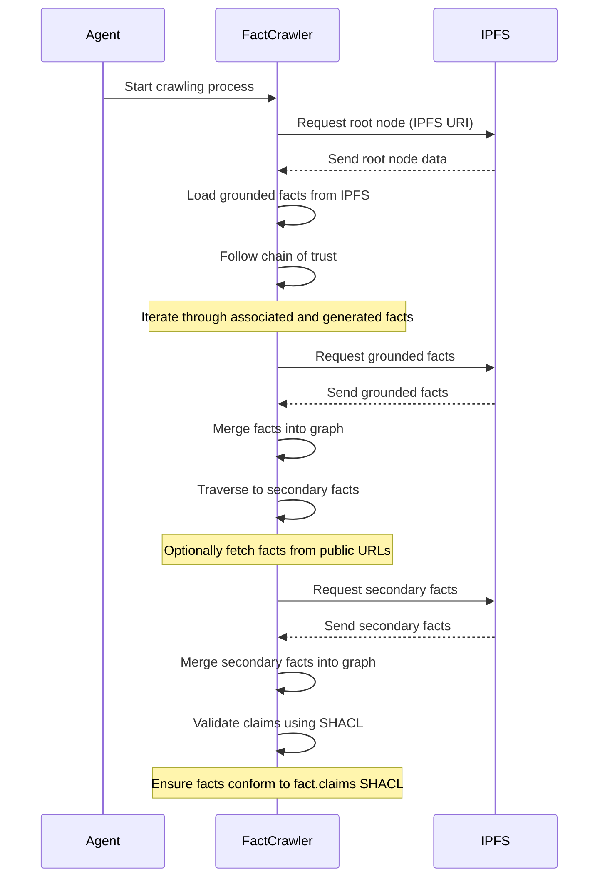
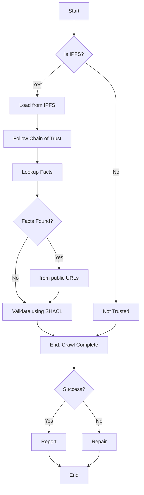

# Tutorial: Building a Fact Claims Crawler

The fact web is represented as web of linked data serialized as JSON-LD. 

As required, URLs referenced within the JSON-LD may be dereferenced at the agent's discretion. 

To curate a `grounded` fact web, we must only start with, and crawl, immutable IPFS URIs (e.g., `ipfs://root-hash`).

It's crucial to ensure that data referenced on the public internet is under your custodianship, is trustworthy, and consistently available.

## Let's get started.

### 1. Choosing a Starting Point:

A dependable starting point is an immutable IPFS URI (e.g., `ipfs://root-hash`) that serves as a portal to the web of facts. 

Ensure this starting point is relevant and trustworthy within your domain.

### 2. Crawling a Web of Facts:

### Start at the Root Fact:

- Initiate the crawler from a designated root node, identified by an immutable IPFS URI.

### 3. Loading Grounded Facts from IPFS:

- Grounded facts act as the foundation of the fact web.
- Retrieve facts from the specified IPFS URI.
- Download and parse data (preferably in JSON-LD format) into new RDF statements.
- Merge these statements into the fact web for further processing.

### 4. Following Chain of Trust:

- Begin traversal from the root node.
- Follow relationships like `prov:wasAssociatedWith` and `prov:wasGeneratedBy`.
- When encountering an object representing a grounded fact (`ipfs://{hash}`), 
    - Dereference the URI and load the RDF data into the fact web.
    - For each statement containing grounded facts, follow the chain of trust recursively.

### 5. Optionally, Retrieving Secondary Facts from Public URLs:

- Explore secondary facts that aren't directly linked to the root node.
- Develop mechanisms to fetch secondary facts from public URLs as needed.
- Handle diverse data formats and sources encountered during secondary fact retrieval.
- Secondary facts are not immutable, this allows for publishing dynamic facts (`handle with care`).

### 6. Validating Claims:

- Ensure the fact web conforms to the `fact.claims` SHACL specification.
- Employ SHACL validation to check for consistency, integrity, and adherence to predefined rules.
- Implement automated validation during or post-crawling.
- Handle any validation errors systematically, providing appropriate feedback or corrective measures.

## An Algortihm for Crawling Ground Facts

