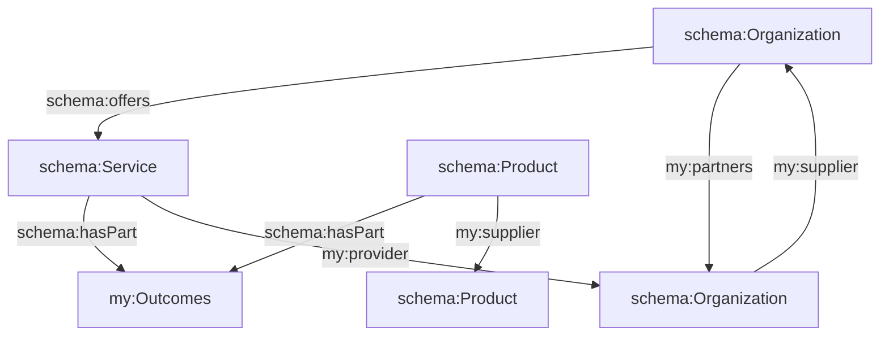

# Fact-based, Trustworthy AI

**A simple solution that is easy to implement, tamper-proof and future-ready.**

## 1. Problem Statement

In 2023, the Internet started buzzing with AI agents, crawlers and language models all vying for their moment of glory. 

We've learned that they can be clever, creative, productive and resourceful

As with all new technologies, new challenges also emerged.

**Too often they are low quality, out of touch, lack integrity and attribution.**

Content creators need a way to verify and demonstrate ownership, receive attribution even negotiate automatic compensation.

Teams building `AI` struggle to know what content is fair use, whether it has permissive licensing and so on. 

We consider the following challenges with respect to AI so that society benefits as a whole.

1. **Data Integrity and Reliability**: Without proper mechanisms in place to ensure data integrity, AI systems may encounter inaccuracies, inconsistencies, or even deliberate misinformation in the raw data they process. This can lead to flawed outputs and unreliable decision-making processes.

2. **Attribution and Trustworthiness**: Raw data often lacks clear attribution, making it difficult for AI systems to determine the source or credibility of the information. This lack of trustworthiness can result in AI systems incorporating unreliable or biased data into their models, leading to skewed outcomes.

3. **Ethical Considerations**: Raw data may contain sensitive or controversial content that raises ethical concerns. AI systems need to be equipped with ethical frameworks and guidelines to handle such data responsibly, ensuring that they do not perpetuate harmful biases or stereotypes.

4. **Legal and Regulatory Compliance**: Data lacking ethical or commercial context may also raise legal and regulatory issues, particularly in terms of data privacy, intellectual property rights, and content licensing. AI systems must navigate these complexities to ensure compliance with relevant laws and regulations.

5. **Contextual Understanding**: Without proper contextual information, AI systems may struggle to interpret and analyze raw data accurately. Ethical and commercial context provides valuable insights into the intended meaning, relevance, and implications of the data, enabling more informed decision-making.

6. **Bias and Fairness**: Raw data, especially when unfiltered, may inadvertently reflect societal biases or prejudices. AI systems trained on such data risk perpetuating or exacerbating these biases in their outputs, leading to unfair or discriminatory outcomes.

7. **Transparency and Explainability**: Understanding the ethical and commercial context of data is essential for ensuring transparency and explainability in AI systems. Stakeholders need to understand how decisions are made and what factors influence AI-generated outputs to trust and effectively use these systems.

## 2. Project Objectives

2.1. **Ensure Trustworthiness**: Ensure that the facts are trustworthy and [immutable](/claim/ipfs) - fostering trust among stakeholders.

2.2. **Semantic Interoperability**: Incorporating standards such as PROV-O, SKOS, and VOID annotations facilitates semantic interoperability. Enable seamless information exchange and collaboration across diverse domains and platforms.

2.3. **Knowledge Curation**: The fact web should serve as a structured repository for organizing and discovering relevant facts by adhering to standards, ontologies and vocabularies, such as PROV-O, SKOS, and VOID.

2.4. **Transparent and Reproducible**: By capturing provenance information using PROV-O, the fact web enables transparent and reproducible research. Auditors can trace the lineage of data and assertions, understand how they were derived or obtained, and verify their authenticity.

2.5. **Reasoning and Analysis**: The fact web facilitates automated reasoning and analysis. By representing data and relationships using standardized RDF, tools can infer new knowledge, detect patterns, and derive insights.

2.6. **Privacy and Security**: While promoting openness and transparency maintain privacy and security of sensitive information. Access control is part of the graph, identifying confidential data, authorized agents, privacy regulations and ethical standards.

2.7. **Collaboration and Sharing**: By providing APIs, query interfaces, and visualization tools, the graph enables seamless collaboration and communication, accelerating the pace of discovery and innovation.

## 3 Fact Claims Architecture

In our architecture, a `fact` is a small atomic unit of knowledge - serialized in JSON-LD format.

The web links one fact to another - in same or separate documents - a technique called `linked data`.

We consider a `grounded fact` to be one stored on IPFS as an [immutable](/claim/ipfs) record.

At runtime, URLs within the JSON-LD may be retrieved at the agent's discretion. 

Unlike IPFS, Internet facts are not tamper-proof. They are dynamic so facts may be ingested by the agent, as required. 

The technical architecture for fact claims consists of several key components:

- **IPFS Network:** A peer-to-peer network of nodes running IPFS software, facilitating the storage and retrieval of files using content-based addressing.
- **Fact Web:** A graph data structure representing interconnected facts and trust claims within the decentralized system.
- **Trust Chains:** Blockchain smart contracts can notarize an [immutable](/claim/ipfs) chain of linked facts, asserting provenance permanetly.
- **Smart Agents:** Interface with the IPFS network and Internet for storage, retrieval, curation, inference, visualization and publication of fact webs.

### 3.1 Conceptual Fact Web

With Linked Data, concepts and documents can be inter-related to describe almost anything.

## 4. Solution Domains

- AI Answer Engines require a new model for finding trusted facts.
- Trust is paramount in assessing the credibility of information sources.
- Fact claims in RDF format, enriched with metadata, serve as foundational elements.
- Verifiable assertions backed by cryptographic proofs and smart contracts ensure trust.
- Real-time algorithms verify dynamic and evolving fact claims.
- Semantic coherence and trust supersede traditional SEO practices.

| Solution Domain  | Use Cases |
|---|---|
| Ecommerce | Promote with [Schema.org](https://schema.org/) - [Products](https://schema.org/Product), [Events](https://schema.org/Event), [Services](https://schema.org/Service), [Offers](https://schema.org/Offer), [Loans/Credit](https://schema.org/LoanOrCredit) |
| Content Creators | Employ metadata standards like [Dublin Core](https://www.dublincore.org/specifications/dublin-core/) and [IPTC](https://iptc.org/standards/photo-metadata/) for multimedia curation -  [Creative Commons](https://creativecommons.org/) for licensing |
| Education | Ensure consistency through [IMS Global Learning](https://www.imsglobal.org/) and [SCORM](https://scorm.com/) - [Learning Resource Metadata Initiative (LRMI)](https://www.imsglobal.org/activity/lrmi) and [CiTo (Citations)](https://sparontologies.github.io/cito/current/cito.html) |
| Regulatory Compliance | Verifiable reports with [XBRL](https://www.xbrl.org/), [FIBO](https://spec.edmcouncil.org/fibo/), and [FIGREGONT](https://finregont.com/) - Ensure transparency and traceability using standards like [PROV-O](https://www.w3.org/TR/prov-o/) |
| Financial Auditing  |  Financial data exchange with [XBRL](https://www.xbrl.org/) - data auditability with [PROV-O](https://www.w3.org/TR/prov-o/) |
| Supply Chain Management | Traceability in supply chain processes with [GS1 Standards](https://www.gs1.org/standards) - Utilize [PROV-O](https://www.w3.org/TR/prov-o/) for tracking changes |
| Healthcare Data Management  | Standards like [HL7](https://www.hl7.org/) and [FHIR](https://www.hl7.org/fhir/) for semantic healthcare data |
| Intellectual Property | Define digital rights with [W3C ODRL](https://www.w3.org/TR/odrl/) for IP management |
| Research & Innovation  | Track research activities with [PROV-O](https://www.w3.org/TR/prov-o/) and [SKOS](https://www.w3.org/2004/02/skos/) - citeusing [CiTo (Citations)](https://sparontologies.github.io/cito/current/cito.html) |
| Environmental Sustainability  | Model environmental data using [OGC SOSA/SSN](https://www.w3.org/TR/vocab-ssn/) |
| Legal Contracts and Agreements  | Model legal matter [Legal Core Ontology](https://spec.edmcouncil.org/fibo/ontology/FND/Law/LegalCore/) - Define digital rights using [W3C ODRL](https://www.w3.org/TR/odrl/) |
| Identity and Access Management  | Digital credentials with [W3C VC](https://www.w3.org/TR/vc-data-model/) and [DID](https://www.w3.org/TR/did-core/) |
| Energy Trading and Grid Management  | Energy market information with [IEC CIM](https://www.iec.ch/cim/) |
| Credential Verification | Credentials using [W3C VC](https://www.w3.org/TR/vc-data-model/) and [Open Badges](https://openbadges.org/) |
| Asset Tokenization and Management | Define tokenomics with [ERC-20](https://eips.ethereum.org/EIPS/eip-20) and [ERC-721](https://eips.ethereum.org/EIPS/eip-721) |
| News and Data-driven Narratives | Story-driven data exchange with [NewsML-G2](https://iptc.org/standards/newsml-g2/) and [NITF](https://iptc.org/standards/nitf/) |

## 5. References

- Benet, J. (2014). IPFS - Content Addressed, Versioned, P2P File System. [arXiv:1407.3561.](https://arxiv.org/abs/1407.3561).
- IPFS Documentation. [docs.ipfs.io](https://docs.ipfs.io/).
- RDF 1.1 Primer. [w3.org/TR/rdf11-primer/](https://www.w3.org/TR/rdf11-primer/).
- JSON-LD 1.1. [w3.org/TR/json-ld11/](https://www.w3.org/TR/json-ld11/).
- ERC-20 Token Standard. [ethereum.org/.../erc-20/](https://ethereum.org/en/developers/docs/standards/tokens/erc-20/).
- Ethereum Smart Contracts. [ethereum.org/.../smart-contracts/](https://ethereum.org/en/developers/docs/smart-contracts/).
- Trustworthy AI. [fact.claims RFC](/rfc/draft).
