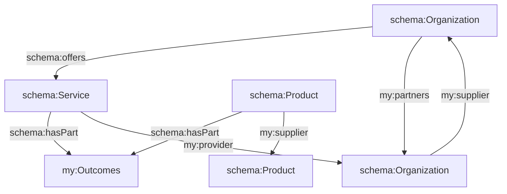
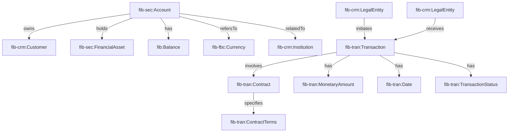
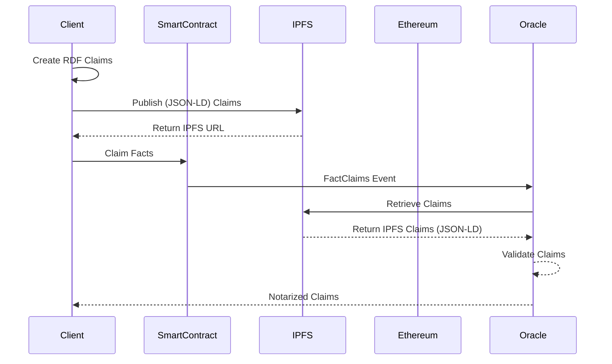

# RFC Draft: Fact Claims - Trustworthy Agentic Collaboration across Autonomous Decentralized Ecosystems

## Status of This Document

This document is a draft (`v0.4`) and has not yet been finalized. Feedback and contributions from the community are welcome. Please refer to the latest version of this document for the most up-to-date information.

Feedback and comments on this specification are welcomed at any time. However, readers should note that the comment period for this specific version of the document has concluded, and the Working Group will not be making substantive modifications to this version of the specification at this stage. 

Any issues or concerns can be reported directly on GitHub, for  more information visit [fact.claims](https://fact.claims/).

The Working Group has received valuable implementation feedback, demonstrating that there are at least two implementations for each normative feature outlined in the specification. 

To delve into further details, please consult the code, test suite and use case reports.

---

## Abstract

In a decentralized, AI-first environment, maintaining trustworthy and immutable data is essential for ensuring transparency, auditability, and reliability. 

This paper proposes a methodology for leveraging the InterPlanetary File System (IPFS), Linked Data (JSON-LD), and Smart Contracts to construct a trusted decentralized network of fact webs. 

By utilizing the distributed, immutable, and censorship-resistant IPFS, we address the challenges associated with decentralized trust and enhance the integrity and auditability of diverse fact claims. 

We outline the technical architecture, design considerations, and implementation strategies for integrating IPFS into existing systems to establish a reliable and tamper-resistant repository for storing and accessing fact claims.

---

## 1. Introduction

Given rapidly evolving artificial intelligence (AI), the need for trustworthy and immutable data has become paramount. 

Decentralized ecosystems, built upon principles of transparency, auditability, and reliability, require robust mechanisms for managing and verifying information exchange. In this context, the establishment of fact claims - assertions of truth or validity regarding specific entities, relationships, or events - plays a crucial role in facilitating trustful collaboration across autonomous decentralized ecosystems.

It encompasses a wide range of activities, from asserting research findings and coordinating project activities to managing legal contracts and tracking supply chain transactions. 

However, ensuring transparency, accountability, and interoperability within such a trustful ecosystem requires a standardized approach for representing facts - a knowledge graph.

## 1.1 Use Case: Supply Chain 

The fact claims ecosystem serves as the backbone for managing trusted collaborations and value exchange in diverse domains, including research, innovation, curation, collaboration, and creativity. 



By adopting standard ontologies such as PROV-O, SKOS, and VOID, we enhance interoperability and facilitate knowledge organization within the ecosystem. 

Facts from multiple sources can be crawled, combined and curated into a custom fact web, rich in contextual understanding for each use case.

## 1.2 Use Case: Financial 




Through this RFC, we aim to lay the groundwork for a future where collaboration thrives securely and reliably, fostering innovation, transparency, and trust among participants.

---

## 2. Objective

This section defines the objectives of the proposal, including the goals, scope, and intended outcomes. It outlines the need for a standardized approach to representing fact claims  and identifies the key technologies and standards utilized.

2.1. **Ensure Trustworthiness**: Ensure that the facts are trustworthy and immutable - fostering trust among stakeholders.

2.2. **Semantic Interoperability**: Incorporating standards such as PROV-O, SKOS, and VOID annotations facilitates semantic interoperability. Enable seamless information exchange and collaboration across diverse domains and platforms.

2.3. **Knowledge Curation**: The fact web should serve as a structured repository for organizing and discovering relevant facts by adhering to standards, ontologies and vocabularies, such as PROV-O, SKOS, and VOID.

2.4. **Transparent and Reproducible**: By capturing provenance information using PROV-O, the fact web enables transparent and reproducible research. Auditors can trace the lineage of data and assertions, understand how they were derived or obtained, and verify their authenticity. 

2.5. **Reasoning and Analysis**: The fact web facilitates automated reasoning and analysis. By representing data and relationships using standardized RDF, tools can infer new knowledge, detect patterns, and derive insights.

2.6. **Privacy and Security**: While promoting openness and transparency maintain privacy and security of sensitive information. Access control is part of the graph, identifying confidential data, authorized agents, privacy regulations and ethical standards.

2.7. **Collaboration and Sharing**: By providing APIs, query interfaces, and visualization tools, the graph enables seamless collaboration and communication, accelerating the pace of discovery and innovation.

---

## 3. Fact Claims Protocol

The `fact web` describes how fact claims are represented as linked data serialized in JSON-LD format. 

JSON-LD provides a lightweight and flexible means to express semantic information in a structured and easily understandable manner. 

### 3.1 Metholody

This RFC proposes a methodology for leveraging the InterPlanetary File System (IPFS), Linked Data (JSON-LD), and Smart Contracts to construct a trusted network of fact webs. 

Through the use of JSON-LD, we ensure semantic interoperability and compatibility, enabling machine-readable representation and interpretation of fact claims. Additionally, Smart Contracts provide governance mechanisms for managing the lifecycle of fact claims, ensuring transparency, and enforcing trust among participants.

The distributed, immutable, and censorship-resistant nature of IPFS, we aim to address the challenges associated with decentralized trust and establish a reliable repository for storing and accessing fact claims. 


The technical architecture outlined in this RFC provides a blueprint for integrating IPFS into existing systems to establish a tamper-resistant repository for storing and accessing fact claims. 

Furthermore, the validation mechanisms outlined in this RFC ensure compliance with predefined constraints and rules, ensuring data integrity and consistency across fact webs.

#### 3.1.1 Fact Claims Workflow



### 3.2. **Create Factual Claims in RDF Format**

- 3.2.1 Define the factual claims using RDF format.

```turtle
@prefix prov: <http://www.w3.org/ns/prov#> .

<https://fact.claims/> prov:generated <https://example.claims/facts/claim1>.

<https://example.claims/facts/claim1> prov:wasAttributedTo <ethereum://0x123abc...> .
```

- 3.2.2. Make useful and necessary assertions with reference to relevant ontologies.

```json-ld
<https://example.claims/facts/claim1>

  rdf:label 'fact claim #1';
  
  rdf:comment 'Trusted Facts for Autonomous Agents'.
```

### 3.3. **Attribution to Ethereum Smart Contract Address**

- 3.2.1. Embed `prov:wasAttributedTo` within the RDF claims to the Ethereum smart contract address (`ethereum://0x123abc...`) serving as the originating entity.

- 3.2.2. These links and backlinks establish the provenance of the claims and provide a traceable connection to the blockchain.

### 3.3. **Link to Websites with JSON-LD References**

- 3.3.1. Include links within the RDF claims to websites containing JSON-LD (Linked Data) documents.

- 3.3.2. These JSON-LD documents further elaborate on and reference the asserted claims, providing additional context and information.

### 3.4. **Convert RDF Claims to JSON-LD Format**

- 3.4.1. As necessary, convert the RDF claims into JSON-LD format to maximize compatibility with other systems and applications.

- 3.4.2. JSON-LD provides a standardized way to represent linked data in JSON format, facilitating interoperability and integration.

### 3.5. **Publish Claims to IPFS**

- 3.5.1. Publish the RDF as JSON-LD to the IPFS (InterPlanetary File System) network.

- 3.5.2. IPFS assigns a unique cryptographic hash to each piece of content, ensuring its immutability and availability.

Example URL format: `ipfs://QmXqPj9sk...`

- 3.5.3. We can't include references to the `ipfs://` URL within its own document, however one can and should reference URLs of previously published IPFS claims.

### 3.6. **Emit FactClaims Event**

- 3.6.1. Emit a FactClaims event on the Ethereum blockchain, containing the `ipfs://...` URL of the published claims.

```solidity
pragma solidity ^0.8.0;

interface IFactClaims {
  event FactClaims(string ipfsURL);

  function claim(string memory ipfsURL) external {
  emit FactClaims(ipfsURL);
  }
}
```

- 3.6.2. This event asserts that the linked data is trusted by the account owner of the contract.

### 3.7. **Validate FactClaims Events**

- 3.7.1. Implement an Oracle / listener for the FactClaims event on the Ethereum blockchain.

- 3.7.2. Dereference the `ipfs://...` provided in the event to retrieve the published claims from the IPFS network.

- 3.7.3. Validate the claims against predefined criteria, ensuring their integrity and authenticity.

- 3.7.4. Only trust those claims that are transitively traceable via `prov:wasAttributedTo` property to the expected `ethereum://` address.

- 3.7.5. Act upon claims and additional assertions according to the use case.

---

## 4. Semantic Interoperability

This section introduces standard semantic ontologies used in the proposal, such as PROV-O, SKOS, and VOID. It outlines the role of these ontologies in enhancing interoperability and compatibility.

By adhering to these standard ontologies and vocabulary definitions, the fact web ensures consistency, compatibility, and seamless integration.

The fact web relies on standard semantic ontologies to ensure interoperability and compatibility across diverse ecosystems

### 4.1 Core Ontologies

#### 4.1.1 PROV-O (Provenance Ontology)

PROV-O furnishes a standardized vocabulary for representing provenance information, facilitating the documentation and tracking of entities, activities, and their relationships. By incorporating PROV-O, the fact web can effectively capture the lineage and historical context of data, decisions, and actions within the ecosystem.

This vocabulary defines the only mandatory fact (`prov:wasAttributedTo`) needed to define a fact claim .

#### 4.1.2 SKOS (Simple Knowledge Organization System)

SKOS presents a standard framework for representing controlled vocabularies and organizing knowledge systems. By utilizing SKOS, the fact web can establish and manage hierarchical and associative relationships among concepts, thereby enhancing semantic enrichment and knowledge organization within the ecosystem.

#### 4.1.3 VOID (Vocabulary of Interlinked Datasets)

VOID provides metadata specifications for describing RDF datasets, including details concerning the dataset's structure, accessibility, and usage. Integration of VOID into the fact web facilitates comprehensive documentation of dataset characteristics and attributes, thereby improving dataset discoverability, accessibility, and interoperability within the ecosystem.

#### 4.1.4 General Knowledge (OpenGraph, Schema.org, and Others)

Additionally, integration with Schema.org, OpenGraph, and similar standards significantly enhances search engine results (SERPs) and addresses the evolving landscape of "answer engines." Considering the importance of trust and relevance in the post-search era, further exploration of these standards is warranted.

### 4.2 Linked Data

- 4.2.1. **Serialization**: The fact web is serialized in JSON-LD format, which extends JSON by adding support for Linked Data. JSON-LD allows for the representation of data in a graph-like structure composed of subject-predicate-object triples, following the RDF data model.

- 4.2.2. **Enriched XHTML**: To enhance human readability, the fact web can be embedded within XHTML documents. This embedding allows for the seamless integration of structured data and semantic annotations within web pages, facilitating both human and machine interpretation.

#### For Example

```json-ld
{
  "@context": {
  "prov": "http://www.w3.org/ns/prov#"
  },
  "@graph": [
  {
  "@id": "ipfs://QmXqPj9sk...",
  "prov:wasAttributedTo": {
  "@id": "ethereum://0x123abc..."
  }
  },
  {
  "@id": "ethereum://0x123abc...",
  "prov:generated": {
  "@id": "ipfs://QmXqPj9sk..."
  },
  "prov:used": {
  "@id": "https://example.claims/facts/claim1"
  }
  },
  {
  "@id": "https://example.claims/facts/claim1",
  "prov:hadPrimarySource": {
  "@id": "ipfs://QmXqPj9sk..."
  }
  },
  {
  "@id": "https://example.claims/facts/claim1",
  "prov:wasDerivedFrom": {
  "@id": "ethereum://0x123abc..."
  }
  }
  ]
}
```

### 4.3 URL Dereferencing

At runtime, URLs referenced within the JSON-LD, especially those residing outside the IPFS subgraph, may be dereferenced at the agent's discretion. This dereferencing process involves retrieving the content associated with a URL from the web and incorporating it into the fact web. It's crucial to ensure that data referenced on the public internet is permalinked, consistently and reliably accessible.

#### 4.3.1 Dynamic Sourcing

Unlike fact claims stored within the IPFS subgraph, Internet-sourced facts need not be immutable. Dynamic observations and updates from external sources may be ingested and inferred by the agent at its discretion. This approach enables the fact web to incorporate real-time data and adapt to evolving information landscapes while maintaining the integrity of internally stored immutable fact claims.

---

## 5. Normative Features

This section outlines the validation process, including SHACL (Shapes Constraint Language) validation, and emphasizes conformance with VOID and PROV-O standards to maintain interoperability and data quality.

| Requirement  | Community Contributions |
|---|---|
| IPFS Integration | [js-ipfs](https://github.com/ipfs/js-ipfs) for JavaScript or [py-ipfs](https://github.com/ipfs/py-ipfs) for Python or [Java IPFS API](https://github.com/ipfs/java-ipfs-http-client) for Java |
| RDF Representation | [Apache Jena](https://jena.apache.org/) for Java or [RDFLib](https://github.com/RDFLib/rdflib) for Python |
| Smart Contract Integration | [Web3.js](https://github.com/ethereum/web3.js/) for JavaScript or [Web3.py](https://github.com/ethereum/web3.py) for Python |
| SHACL Validation | [TopQuadrant SHACL](https://github.com/TopQuadrant/shacl) or [Eclipse RDF4J SHACL](https://rdf4j.org/documentation/programming/shacl/)  |


### 5.1 JSON-LD and SHACL Validation

The validation uses SHACL to ensure compliance with the protocol's simplest semantics, your use case likely includes additional steps.

As a minimum, a fact web should conform to the following SHACL

```turtle
trust:FactClaims
  a sh:NodeShape ;
  sh:targetClass prov:Entity ;
  sh:property [
  sh:path prov:generated ;
  sh:minCount 1 ;
  sh:nodeKind sh:IRI ;
  ] ;
  sh:property [
  sh:path prov:wasAttributedTo ;
  sh:minCount 1 ;
  sh:nodeKind sh:IRI ;
  ] .
```

### 5.2 Immutable Fact Claims

In fact claims ecosystems, establishing the immutability of data is crucial for building trust and reliability. The integration of IPFS (InterPlanetary File System) and RDF not only ensures immutability but also provides cryptographic proof of ownership.

5.2.1. **Unique Identification** IPFS assigns a unique cryptographic hash to each piece of content, including fact claims. This hash, derived from the content itself, serves as the content's address on the IPFS network, securely linking the content's identity to its actual data.

5.2.2. **Immutable Nature** Utilizing cryptographic hashing algorithms like SHA-256, IPFS ensures that any modification to the content results in a completely different hash. Thus, even the slightest alteration to the content produces a distinct address, rendering the original content immutable.

5.2.3. **Decentralized Distribution** IPFS content is distributed across multiple nodes. When a fact claim is added to IPFS, it gets replicated across numerous nodes, ensuring redundancy and resilience. This further strengthens the immutability of the content.

### 5.3 Cryptographic Ownership

5.3.1. **FactClaims Provenance Protocol** Upon publishing a fact claim to IPFS, a corresponding smart contract event (e.g., FactClaim(string ipfsURL)) is emitted. This event, integrated with the Fact Claims provenance protocol, establishes cryptographic proof of ownership by linking the fact claim to the DAO (Decentralized Autonomous Organization), smart contract, and/or private key holder.

5.3.2. **Smart Contract Integration** The smart contract event serves as an immutable record of the fact claim's publication, attributing ownership to the entity that initiated the event. This integration with smart contracts ensures transparency, traceability, and accountability in the generation and evolution of fact claims.

### 5.4 Semantic Representation

5.4.1. **Semantic Interoperability** RDF provides a standardized framework for representing data in a semantic format. Fact claims, along with their associated metadata and relationships, can be represented using RDF vocabularies such as PROV-O and VOID (Vocabulary of Interlinked Datasets). This semantic representation enhances interoperability and machine readability.

5.4.2. **Provenance and Attribution** RDF enables the representation of provenance information, including attribution, sources, and lineage of fact claims. By incorporating PROV-O, fact claims can include metadata describing their origins, transformations, and ownership. This provenance information enhances transparency and trust in the data.

### 5.5 Web of Trust

5.5.1. **Verification Mechanisms** IPFS enables verification mechanisms that allow users to verify the integrity of fact claims by recalculating their content hashes and comparing them with the expected addresses. This process ensures that the content remains unchanged and authentic, enhancing trust and reliability.

5.5.2. **Semantic Integrity** By crawling the fact web, the trustworthiness and provenance of fact claims can be inspected.

---

## 6. Solution Domains

This section explores various use cases for fact claims, including regulatory compliance, financial auditing, supply chain management, healthcare data management, and more. It discusses the standards and technologies relevant to each use case.

- AI-powered answer engines require a new model for finding facts.
- Trust is paramount in assessing the credibility of information sources.
- Fact claims in RDF format, enriched with metadata, serve as foundational elements.
- Verifiable assertions backed by cryptographic proofs and smart contracts ensure trust.
- Real-time algorithms verify dynamic and evolving fact claims.
- Semantic coherence and trust supersede traditional SEO practices.

| Solution Domain  | Useful Vocabularies and Semantics |
|---|---|
| Ecommerce | - [Schema.org Products](https://schema.org/Product), [Events](https://schema.org/Event), [Services](https://schema.org/Service), [Offers](https://schema.org/Offer), [Loans/Credit](https://schema.org/LoanOrCredit), [etc ...](https://schema.org/) |
| Content Creators | - [Dublin Core Metadata Initiative](https://www.dublincore.org/specifications/dublin-core/) - [Creative Commons licenses](https://creativecommons.org/) - [IPTC Photo Metadata](https://iptc.org/standards/photo-metadata/) |
| Education | - [IMS Global Learning Consortium standards](https://www.imsglobal.org/) - [SCORM (Sharable Content Object Reference Model)](https://scorm.com/scorm-explained/) - [Learning Resource Metadata Initiative (LRMI)](https://www.imsglobal.org/activity/lrmi)  - [CiTo (Citations)](https://sparontologies.github.io/cito/current/cito.html)|
| Regulatory Compliance | - [XBRL (eXtensible Business Reporting Language)](https://www.xbrl.org/) - [FIBO (Financial Industry Business Ontology)](https://spec.edmcouncil.org/fibo/) - [FIGREGONT (Financial Industry Regulatory and Governance)](https://finregont.com/) |
| Financial Auditing  | - [XBRL (eXtensible Business Reporting Language)](https://www.xbrl.org/) - [PROV-O](https://www.w3.org/TR/prov-o/)  |
| Supply Chain Management | - [GS1 Standards](https://www.gs1.org/standards) - [PROV-O](https://www.w3.org/TR/prov-o/)  |
| Healthcare Data Management  | - [HL7 (Health Level Seven International)](https://www.hl7.org/) - [FHIR (Fast Healthcare Interoperability Resources)](https://www.hl7.org/fhir/) |
| Intellectual Property | - [W3C ODRL (Open Digital Rights Language)](https://www.w3.org/TR/odrl/)  |
| Research & Innovation  | - [PROV-O](https://www.w3.org/TR/prov-o/) - [SKOS (Simple Knowledge Organization System)](https://www.w3.org/2004/02/skos/) - [CiTo (Citations)](https://sparontologies.github.io/cito/current/cito.html) |
| Environmental Sustainability  | - [OGC SOSA/SSN (Spatial Data on the Web Best Practices)](https://www.w3.org/TR/vocab-ssn/) |
| Legal Contracts and Agreements  | - [W3C ODRL (Open Digital Rights Language)](https://www.w3.org/TR/odrl/)  |
| Identity and Access Management  | - [W3C VC (Verifiable Credentials)](https://www.w3.org/TR/vc-data-model/) - [DID (Decentralized Identifiers)](https://www.w3.org/TR/did-core/)  |
| Energy Trading and Grid Management  | - [IEC CIM (Common Information Model for Energy Markets)](https://www.iec.ch/cim/)  |
| Credential Verification | - [W3C VC (Verifiable Credentials)](https://www.w3.org/TR/vc-data-model/) - [Open Badges (Open Badges Specification)](https://www.imsglobal.org/sites/default/files/Badges/OBv2p0/index.html) |
| Asset Tokenization and Management | - [ERC-20 (Ethereum Request for Comments 20)](https://eips.ethereum.org/EIPS/eip-20) - [ERC-721 (Ethereum Request for Comments 721)](https://eips.ethereum.org/EIPS/eip-721)  |
| News and Data-driven Narratives | - [NewsML-G2 (News Markup Language - Generation 2)](https://iptc.org/standards/newsml-g2/) - [NITF (News Industry Text Format)](https://iptc.org/standards/nitf/) - [Linked Data Platform (LDP)](https://www.w3.org/TR/ldp/) - [Semantic Web Standards (RDF, RDFa, JSON-LD)](https://www.w3.org/RDF/) - [Schema.org](https://schema.org/) - [W3C Data Catalog Vocabulary (DCAT)](https://www.w3.org/TR/vocab-dcat/) |


---

## 7. Integrity, Security and Privacy

This section addresses key concerns, focusing on best practices for mitigating risks and safeguarding trust.

### 7.1 Compliance with Semantic Standards

Fact webs should conform to standard semantic ontologies like VOID and PROV-O. 

Adhering to these standards ensures semantic interoperability, facilitating seamless integration and exchange of fact claims across diverse platforms.

### 7.2 Immutable Fact Claims

Ensuring the immutability of data is crucial for establishing trust. Integration of IPFS and RDF not only ensures immutability but also provides cryptographic proof of ownership provenance protocol.

- **Unique Identification**: IPFS assigns a unique cryptographic hash to each content piece, ensuring its identity and integrity.
- **Immutable Nature**: Modifications to content result in distinct hashes, preserving original content integrity.
- **Decentralized Distribution**: Content is replicated across IPFS nodes, ensuring redundancy and resilience.

### 7.3. Cryptographic Ownership

- **FactClaims Provenance Protocol**: Emitting a smart contract event links fact claims to DAO, smart contract, or private key holder, establishing cryptographic ownership.
- **Smart Contract Integration**: Smart contract events serve as immutable records, ensuring transparency and accountability.

### 7.4. Semantic Interactivity

- **Semantic Interoperability**: RDF enables semantic representation of fact claims, enhancing interoperability.
- **Provenance and Attribution**: Incorporating PROV-O allows metadata representation, enhancing transparency and trust.

### 7.5. Verification and Trust

- **Verification Mechanisms**: IPFS enables content integrity verification, enhancing trust and reliability.
- **Semantic Integrity**: Combining IPFS immutability with RDF semantic representation fosters greater trust in fact claims' accuracy and context.

---

## 8. Acknowledgments and References

We acknowledge contributions from many individuals or organizations who shared expertise, feedback, review, or other assistance during the development of the proposal.

- [XBRL (eXtensible Business Reporting Language)](https://www.xbrl.org/)
- [NewsML-G2 (News Markup Language - Generation 2)](https://iptc.org/standards/newsml-g2/)
- [NITF (News Industry Text Format)](https://iptc.org/standards/nitf/)
- [Linked Data Platform (LDP)](https://www.w3.org/TR/ldp/)
- [PROV-O](https://www.w3.org/TR/prov-o/)
- [SKOS (Simple Knowledge Organization System)](https://www.w3.org/2004/02/skos/)
- [RDF](https://www.w3.org/RDF/)
- [RDFa](https://www.w3.org/TR/xhtml-rdfa/)
- [JSON-LD](https://json-ld.org/)
- [Schema.org](https://schema.org/)
- [W3C Data Catalog Vocabulary (DCAT)](https://www.w3.org/TR/vocab-dcat/)
- [GS1 Standards](https://www.gs1.org/standards)
- [HL7 (Health Level Seven International)](https://www.hl7.org/)
- [FHIR (Fast Healthcare Interoperability Resources)](https://www.hl7.org/fhir/)
- [W3C ODRL (Open Digital Rights Language)](https://www.w3.org/TR/odrl/)
- [OGC SOSA/SSN (Spatial Data on the Web Best Practices)](https://www.w3.org/TR/vocab-ssn/)
- [IEC CIM (Common Information Model for Energy Markets)](https://www.iec.ch/cim/)
- [W3C VC (Verifiable Credentials)](https://www.w3.org/TR/vc-data-model/)
- [DID (Decentralized Identifiers)](https://www.w3.org/TR/did-core/)
- [ERC-20 (Ethereum Request for Comments 20)](https://eips.ethereum.org/EIPS/eip-20)
- [ERC-721 (Ethereum Request for Comments 721)](https://eips.ethereum.org/EIPS/eip-721)


### GitHub Repositories

- [W3C](https://github.com/w3c/)
- [IPFS](https://github.com/ipfs)
- [Solidity Smart Contracts](https://github.com/ethereum/solidity)

---

## 9. Changes from Previous Versions

As applicable, this section summarizes the changes made in the current version compared to earlier versions of the proposal.

#### Draft 0.4 (Current Version):
- Added Normative Features ensuring adherence to a standardized event structure.
- Added clarity to specification and improved quality and consistency of code snippets.

#### Draft 0.3:
- Added JSON-LD and RDF specifications and examples to facilitate interoperability and data exchange, enhancing the proposal's compatibility with linked data standards.
- Draft sections for various components and functionalities, outlining the structure and scope of the proposal.

#### Draft 0.2:
- Created the initial version of the `fact flaims` contract, laying the foundation for the proposed Ethereum smart contract.
- Implemented the `claim` function to emit the `FactClaim` event with the provided `ipfsURL`, enabling the publication of fact claims with corresponding IPFS URLs.

#### Draft 0.1:
- Initial draft outlining the concept and structure of the FactClaims proposal, providing an overview of the intended protocol for publishing fact claims.
- Introduced the proposed protocol for publishing fact claims, setting the groundwork for subsequent iterations and developments.