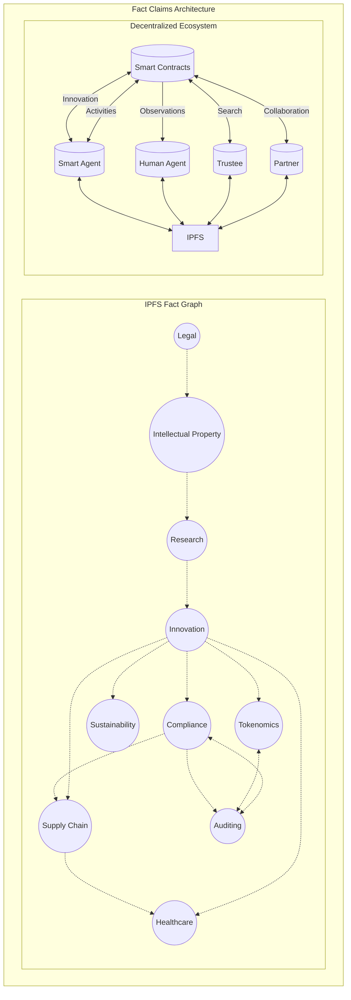

# Fact Claims: Towards Trustworthy AI

GivenThe need for trustworthy and immutable data has become paramount. 

We need principles of transparency, auditability, and reliability. 

In this context, the establishment of `fact claims` - assertions of truth or validity regarding specific entities, relationships, or events - plays a crucial role.

The `fact claims` ecosystem serves as the backbone for managing trusted collaborations and value exchange in diverse domains, including research, innovation, curation, collaboration, and creativity. 

It encompasses a wide range of activities, from asserting research findings and coordinating project activities to managing legal contracts and tracking supply chain transactions. 

However, ensuring transparency, accountability, and interoperability within such a trustful ecosystem requires a standardized approach for representing facts - a knowledge graph.

Traditional centralized storage solutions, while effective in some contexts, pose several challenges. 

These challenges include single points of failure, data manipulation risks, lack of attribution, weak licensing, provenance and is vulnerable to censorship and tampering. 

We seek a simple innovative solution to address these challenges that enhances the integrity and auditability of our AI and answer engines.

The [Fact Claims RFC](./rfc/draft.md) proposes a methodology for leveraging the [InterPlanetary File System (IPFS)](https://ipfs.io/), [Linked Data (JSON-LD)](https://json-ld.org/), and [Smart Contracts](https://ethereum.org/) to construct a trusted network of fact graphs..

---

## Objective

This section defines the objectives of the proposal, including the goals, scope, and intended outcomes.

2.1. **Ensure Trustworthiness**: Ensure that the facts are trustworthy and immutable - fostering trust among stakeholders.

2.2. **Semantic Interoperability**: Incorporating standards such as PROV-O, SKOS, and VOID annotations facilitates semantic interoperability. Enable seamless information exchange and collaboration across diverse domains and platforms.

2.3. **Knowledge Curation**: The fact graph should serve as a structured repository for organizing and discovering relevant facts by adhering to standards, ontologies and vocabularies, such as PROV-O, SKOS, and VOID.

2.4. **Transparent and Reproducible**: By capturing provenance information using PROV-O, the fact graph enables transparent and reproducible research. Auditors can trace the lineage of data and assertions, understand how they were derived or obtained, and verify their authenticity.

2.5. **Reasoning and Analysis**: The fact graph facilitates automated reasoning and analysis. By representing data and relationships using standardized RDF, tools can infer new knowledge, detect patterns, and derive insights.

2.6. **Privacy and Security**: While promoting openness and transparency maintain privacy and security of sensitive information. Access control is part of the graph, identifying confidential data, authorized agents, privacy regulations and ethical standards.

2.7. **Collaboration and Sharing**: By providing APIs, query interfaces, and visualization tools, the graph enables seamless collaboration and communication, accelerating the pace of discovery and innovation.

## Fact Claims Architecture

The fact graph is represented as linked data serialized as JSON-LD. 

At runtime, URLs referenced within the JSON-LD, especially those residing outside the IPFS subgraph, may be de-referenced at the agent's discretion. 

Additionally, for enhanced human readability, one could publish XHTML documents embedded with JSON-LD, including the millions of sites that already support SEO rich snippets. 

It's crucial to ensure that data referenced on the public internet is under your custodianship, is trustworthy and consistently available. 

Unlike the IPFS fact claims, Internet-sourced facts need not be immutable, so that dynamic observations may be ingested and inferred by the agent at its discretion. 

This approach enables seamless integration of structured data and semantic annotations within HTML documents, fostering interoperability and facilitating machine-readable interpretation.

The technical architecture for fact claims consists of several key components:

- **IPFS Network:** A peer-to-peer network of nodes running IPFS software, facilitating the storage and retrieval of files using content-based addressing.
- **Fact Graph:** A graph data structure representing interconnected fact graphs and claims within the decentralized system.
- **Trust Chains:** Blockchain smart contracts manage governance of an immutable custody chain of fact graphs.
- **Smart Agents:** Interface with the IPFS network and Internet for storage, retrieval, curation, inference, visualization and publication of fact graphs.

## Use Cases

- AI Answer Engines require a new model for finding trusted facts.
- Trust is paramount in assessing the credibility of information sources.
- Fact claims in RDF format, enriched with metadata, serve as foundational elements.
- Verifiable assertions backed by cryptographic proofs and smart contracts ensure trust.
- Real-time algorithms verify dynamic and evolving fact claims.
- Semantic coherence and trust supersede traditional SEO practices.

| Problem Domain                        | Standards                                                                                                                                                                      |
|---------------------------------------|--------------------------------------------------------------------------------------------------------------------------------------------------------------------------------|
| Regulatory Compliance                 | - [XBRL (eXtensible Business Reporting Language)](https://www.xbrl.org/) - [FIBO (Financial Industry Business Ontology)](https://spec.edmcouncil.org/fibo/) - [FIGREGONT (Financial Industry Regulatory and Governance)](https://finregont.com/)                                                                                                                                                           |
| Financial Auditing                    | - [XBRL](https://www.xbrl.org/) - [RDF](https://www.w3.org/RDF/) - [PROV-O](https://www.w3.org/TR/prov-o/)                                                                                                         |
| Supply Chain Management               | - [GS1 Standards](https://www.gs1.org/standards) - [RDF](https://www.w3.org/RDF/) - [PROV-O](https://www.w3.org/TR/prov-o/)                                                                 |
| Healthcare Data Management            | - [HL7 (Health Level Seven International)](https://www.hl7.org/) - [FHIR (Fast Healthcare Interoperability Resources)](https://www.hl7.org/fhir/) - [RDF](https://www.w3.org/RDF/)                                                                                             |
| Intellectual Property Management      | - [W3C ODRL (Open Digital Rights Language)](https://www.w3.org/TR/odrl/) - [RDF](https://www.w3.org/RDF/)                                                                                                          |
| Research Collaboration                | - [PROV-O](https://www.w3.org/TR/prov-o/) - [SKOS (Simple Knowledge Organization System)](https://www.w3.org/2004/02/skos/) - [RDF](https://www.w3.org/RDF/)                                                                                   |
| Innovation Tracking                   | - [W3C PROV-O](https://www.w3.org/TR/prov-o/) - [RDF](https://www.w3.org/RDF/)                                                                                                             |
| Environmental Sustainability          | - [OGC SOSA/SSN (Spatial Data on the Web Best Practices)](https://www.w3.org/TR/vocab-ssn/) - [RDF](https://www.w3.org/RDF/)                                                                                   |
| Legal Contracts and Agreements        | - [W3C ODRL (Open Digital Rights Language)](https://www.w3.org/TR/odrl/) - [RDF](https://www.w3.org/RDF/)                                                                                                          |
| Identity and Access Management        | - [W3C VC (Verifiable Credentials)](https://www.w3.org/TR/vc-data-model/) - [DID (Decentralized Identifiers)](https://www.w3.org/TR/did-core/) - [RDF](https://www.w3.org/RDF/)                                                                                       |
| Energy Trading and Grid Management    | - [IEC CIM (Common Information Model for Energy Markets)](https://www.iec.ch/cim/) - [RDF](https://www.w3.org/RDF/)                                                                                                     |
| Education and Credential Verification | - [W3C VC (Verifiable Credentials)](https://www.w3.org/TR/vc-data-model/) - [Open Badges (Open Badges Specification)](https://www.imsglobal.org/sites/default/files/Badges/OBv2p0/index.html) - [RDF](https://www.w3.org/RDF/)                                          |
| Asset Tokenization and Management     | - [ERC-20 (Ethereum Request for Comments 20)](https://eips.ethereum.org/EIPS/eip-20) - [ERC-721 (Ethereum Request for Comments 721)](https://eips.ethereum.org/EIPS/eip-721) - [RDF](https://www.w3.org/RDF/)                                                               |
| News and Data-driven Narratives       | - [NewsML-G2 (News Markup Language - Generation 2)](https://iptc.org/standards/newsml-g2/) - [NITF (News Industry Text Format)](https://iptc.org/standards/nitf/) - [Linked Data Platform (LDP)](https://www.w3.org/TR/ldp/) - [Semantic Web Standards (RDF, RDFa, JSON-LD)](https://www.w3.org/RDF/) - [Schema.org](https://schema.org/) - [W3C Data Catalog Vocabulary (DCAT)](https://www.w3.org/TR/vocab-dcat/) |

## References

- Benet, J. (2014). IPFS - Content Addressed, Versioned, P2P File System. [arXiv:1407.3561.](https://arxiv.org/abs/1407.3561).
- IPFS Documentation. [docs.ipfs.io](https://docs.ipfs.io/).
- RDF 1.1 Primer. [w3.org/TR/rdf11-primer/](https://www.w3.org/TR/rdf11-primer/).
- JSON-LD 1.1. [w3.org/TR/json-ld11/](https://www.w3.org/TR/json-ld11/).
- ERC-20 Token Standard. [ethereum.org/.../erc-20/](https://ethereum.org/en/developers/docs/standards/tokens/erc-20/).
- Ethereum Smart Contracts. [ethereum.org/.../smart-contracts/](https://ethereum.org/en/developers/docs/smart-contracts/).
- Trustworthy Agentic Collaboration. [fact.claims](https://fact.claims/rfc/).

## Next Steps

Adopting a standardized approach for representing factual claims enhances transparency, interoperability, and trust among participants. 

By adhering to semantic standards, ontologies, and validation mechanisms, we can effectively collaborate and offer value, innovation and knowledge sharing.

We hope our  methodology paves the way for a future where collaboration thrives securely and reliably.

- [Smart Trust](./SmartTrust.md)
- [Case Studies](./usecase/)
- [RFC](./rfc/)
